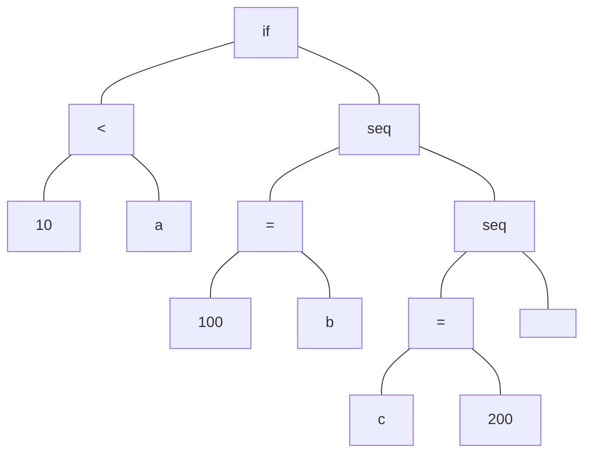

[toc]

%TOC%

# Введение

Целью данной курсовой работы стала разработка компилятора для языка высокого уровня TypeScript на язык ассемблера (MASM).  

 

Компилятор — это специальная программа, которая переводит текст программы, написанный на языке программирования, в набор машинных кодов или на язык ассемблера.

Компиляция — сборка программы, включающая трансляцию всех модулей программы, написанных на одном или нескольких исходных языках программирования высокого уровня и/или языке ассемблера, в эквивалентные программные модули на низкоуровневом языке, близком машинному коду, иногда на язык ассемблера, или непосредственно на машинном языке или ином двоичнокодовом низкоуровневом командном языке и последующую сборку исполняемой машинной программы.

В случае данной курсовой работы, компилятор будет производить компиляцию программы из одного файла на языке TypeScript в один выходной файл на языке ассемблера.

 

Компиляцию можно разбить на несколько основных этапов:

1. Лексический анализ («токенизация», от англ. tokenizing) — процесс аналитического разбора входной последовательности символов на распознанные группы — лексемы, с целью получения на выходе идентифицированных последовательностей, называемых «токенами» (подобно группировке букв в словах).

2. Синтаксический анализ (или разбор, жарг. парсинг, англ. parsing) в лингвистике и информатике — процесс сопоставления линейной последовательности лексем (слов, токенов) естественного или формального языка с его формальной грамматикой. Результатом обычно является дерево разбора (синтаксическое дерево).

3. Семантический анализ — это этап компиляции, предназначенный для различных проверок синтаксической корректности входного кода, а также выделения составляющих, таких как переменные или функции.

4. Генерация кода — это автоматическое создание программного кода специальным приложением, при котором по заданным условиям полностью или частично формируется исходный код программы. Такое специальное приложение называется генератором кода. 

 

Большинство компиляторов переводит программу с некоторого высокоуровневого языка программирования в машинный код, который может быть непосредственно выполнен физическим процессором, однако в данной работе компиляция будет производится на язык ассемблера. С языка ассемблера в машинный код будет переводить отдельный, уже готовый, компилятор, который входит в состав пакета MASM32.

 

Macro Assembler (MASM) — ассемблер для процессоров семейства x86. Первоначально был произведён компанией Microsoft для написания программ в операционной системе MS-DOS и был в течение некоторого времени самым популярным ассемблером, доступным для неё.

 

 

Компилятор, в данной работе, должен поддерживать следующие возможности языка:

1. Математические выражения

2. Логические выражения

3. Оператор(ы) цикла

4. Оператор(ы) ветвления

5. Функции и/или процедуры с корректной реализацией механизмов вызова, передачи и возврата параметров.

6. Функции ввода вывода или возможность использовать стандартные библиотеки.


# Лексический анализ

## Описание

Лексический анализатор (ЛА) — это первый этап процесса компиляции, на котором символы, составляющие исходную программу, группируются в отдельные минимальные единицы текста, несущие смысловую нагрузку — лексемы. 

Задача лексического анализа - выделить лексемы и преобразовать их к виду, удобному для последующей обработки. ЛА использует контекстный анализ и таблицу состояний [1]. 

## Входной язык

Входным языком является подмножество языка TypeScript. В данной реализации обязательна строгая статическая типизация. Доступны следующие типы:

1. `number` — целое число;
2. `boolean` — логическая переменная;
3. `string` — только константные строки;
4. `number[]` — массив целых чисел;
5. `boolean[]` — массив логических переменных;


**Алфавит **языка следующий:

1. Строчные и прописные буквы латинского алфавита;

2. Цифры от 0 до 9;

3. Символ `_` (подчеркивания);

4. Набор специальных символов

   ' " {} , | [ ] + - % / \ ; ‘ : ? < > = ! & # ~ ^ . \*

5. Прочие символы.

**Типы слов:**

1. Ключевые слова.
2. Идентификаторы (имена переменных).
3. Символы (знаки) операций.
4. Разделители.
5. Литералы (константы) — фиксированные значения, которые программа не может изменять. Способ представления литерала зависит от его типа (например 'a' – символьная константа).

Из слов строятся выражения (предложения), команды.

В TypeScript признаком конца команды является символ `;` (точка с запятой).

## Выходной язык

В качестве выходного языка взят язык `assembler`, а точнее его реализация `masm`. 

**Алфавит **языка следующий:

1. Латинские символы от А до Z, знаки `@`, `#` , `_`, которые используются наравне с буквами. Строчные или прописные символы программой-ассемблером не различаются. Записи вида: `mov eax, 9` и `MOV EAX, 9` воспринимаются одинаково.

2. Цифры от 0 до 9

3. Набор специальных символов: 

   +, -, *, /, (,), запятая , точка, , =, апострофы, двоеточие, &(амперсанд), пробел.

Программа представляет собой набор предложений (операторов),. Предложение состоит из нескольких полей. Поля записываются в определенном порядке с соблюдением принятых правил. Предложение имеет следующие поля:

`[название] код операции [операнды] [комментарий]`

Каждый оператор записывается с новой строки. Поля отделяются друг от друга одним или несколькими пробелами. Операнды (если их несколько) отделяются друг от друга запятой.

**Название **предложения — это имя, которое начинается с буквы, содержит не более 8 символов (букв или цифр).

**Код операции** — это мнемокод (условное обозначение) машинной команды, или имя команды транслятору, или имя макрокоманды.

**Операнды** —это объекты, используемые при выполнении данной операции.

**Комментарий ** — это пояснение к исходной программе. В ассемблере комментарий ставится после точки с запятой:

Например: `mov ah,9 ; это комментарий`.

## Реализация

Основным классом реализующим лексический анализ является класс `Lexer`. Класс имеет следующие поля:

1. `string m_code` — код из файла, который разбирается;
2. `vector<Token*> m_tokens` — массив токенов, на которые разбивается исходный код программы;
3. `LexerState m_state` — текущее состояние лексического анализатора;
4. `size_t m_current_token_index` — индекс текущего токена. Данный индекс описывает токен, который сейчас обрабатывается в синтаксическом анализаторе.

Класс имеет основной метод `void parse()`, реализующий непосредственно лексический анализ.

Также класс имеет набор вспомогательных методов:

1. `void open(const string& file_path)` — метод реализует открытие файла и считывания из него исходного кода;
2. `void skip_excess_symbols(int& index, size_t& current_line, size_t& current_pos)` — метод реализует пропуск неважных символов, таких как пробелы и переносы строк;
3. `static bool is_split_symbol(const char& symbol)` — метод проверяет, является ли текущий символ разделительным;
4. `static bool is_token_symbol(const char& symbol)` — метод проверяет, является ли текущий символ, таким символом, который должен быть представлен, как отдельный токен;
5. `static bool next_symbol_is_part_of_token(const char& token, const char& symbol)` — метод проверяет, является ли следующий символ с текущим составным токеном (например, символ `!` и символ `=`, это составной токен);
6. `static bool is_correct_identifier(const string& token)` — метод проверяет, является ли переданное значение корректным идентификатором;
7. `void print_tokens()` — метод распечатывающий все токены, которые были выделены на стадии лексического анализа. 

А также имеет набор методов для синтаксического анализа:

1. `bool next_token()` — метод сдвигает индекс текущего токена на 1;
2. `Token& current_token()` — метод возвращает текущий токен;
3. `TokenType current_token_type()` — метод возвращает тип текущего токена.


Работа лексического анализатора построена на однократном проходе строки с исходным кодом. Во время прохода происходит "накопление" текущего значения токена во временной переменной, когда анализатор встречает разделительный символ, он создает токен на базе той временной переменной, добавляет его в массив токенов и очищает временную переменную, для дальнейшего "накопления" нового токена.

Для того, чтобы корректно обрабатывать строковые константы, введены состояния. Анализатор имеет 2 состояния:

1. `DEFAULT` — описывает стандартное состояние;
2. `IN_STRING `— описывает состояние, когда анализатор встретил строковую константу.

В зависимости от состояния, анализатор по-разному разбирает строку на токены. Так, встречая разделитель в строковой константе, анализатор не считает, что токен закончен и не добавляет его в массив токенов.


Для описания токена используется класс `Token`. Класс имеет два основных поля:

1. `string m_lexeme` — значение токена;
2. `TokenType m_type` — его тип.

Тип токена определяется на стадии создания объекта класса. Для этого используется метод `static TokenType what_type_of_lexeme(const string& lexeme)`, который принимает значение токена, а возвращает его тип. В конструкторе, это выглядит следующий образом:

```cpp
Token(const std::string& lexeme, size_t line = 0, size_t pos = 0)
{
    this->m_lexeme = lexeme;
    this->m_type = what_type_of_lexeme(lexeme);

    this->m_line = line;
    this->m_pos = pos;
}
```

Также класс содержит два вспомогательных поля:

1. `size_t m_line` — линия, где находится токен;
2. `size_t m_pos` — позиция в линии, где находится токен.


Метод реализующий определение типа токена по лексеме использует набор сравнений, в каждом из которых, значение токена сравнивается с предопределенным значение и в случае равенства, возвращается предопределенный тип. Ниже приведен пример такого рода проверок:

```cpp
if (lexeme == "let")
    return TokenType::LET;
if (lexeme == "const")
    return TokenType::CONST;
```

Тип токена описывается с помощью перечисления `TokenType`. Данное перечисление содержит типы всех допустимых токенов (59 штук).

Класс реализует методы для получения всех выше обозначенных полей класса, а также набор вспомогательных, для синтаксического анализатора.


## Результат работы

Результатом работы лексического анализатора является набор токенов.

# Синтаксический анализ

## Описание

Задача синтаксического анализатора — провести разбор текста программы, сопоставив его с эталоном, данным в описании языках[1]. Структура конструкций синтаксического анализатора более сложна, чем структура идентификаторов и чисел. Поэтому для описания синтаксиса языка нужны более мощные грамматики нежели регулярные. Для этих целей были использованы контекстно-свободные грамматики.

### Грамматика

Входной язык имеет следующую грамматику. Грамматика описана в форме Бэкуса-Наура.

```
primary_expression
	: IDENTIFIER
	| CONSTANT
	| "true"
	| "false"
	| STRING_LITERAL
	| '(' expression ')'
	;

type_specifier
	: "number"
	| "boolean"
	| "number[]"
	| "boolean[]"
	| "void"
	;

type_qualifier
	: "let"
	| "const"
	;

direct_declarator
	: IDENTIFIER ':' type_specifier
	;
	
direct_declarator_list
	: direct_declarator
	| direct_declarator_list ',' direct_declarator

declaration_specifiers
	: type_qualifier direct_declarator ';'
	| type_qualifier direct_declarator '=' expression
	;

postfix_expression
	: primary_expression
	| postfix_expression '[' expression ']'
	| postfix_expression '(' ')'
	| postfix_expression '(' argument_expression_list ')'
	| postfix_expression "++"
	| postfix_expression "--"
	;

argument_expression_list
	: assignment_expression
	| argument_expression_list ',' assignment_expression
	;

unary_expression
	: postfix_expression
	| unary_operator cast_expression
	;

unary_operator
	: '-'
	| '!'
	;

multiplicative_expression
	: unary_expression
	| multiplicative_expression '*' unary_expression
	| multiplicative_expression '/' unary_expression
	;

additive_expression
	: multiplicative_expression
	| additive_expression '+' multiplicative_expression
	| additive_expression '-' multiplicative_expression
	;

relational_expression
	: additive_expression
	| relational_expression '<' additive_expression
	| relational_expression '>' additive_expression
	| relational_expression "<=" additive_expression
	| relational_expression ">=" additive_expression
	;

equality_expression
	: relational_expression
	| equality_expression "!=" relational_expression
	| equality_expression "==" relational_expression
	;

logical_and_expression
	: equality_expression
	| logical_and_expression "&&" equality_expression
	;

logical_or_expression
	: logical_and_expression
	| logical_or_expression "||" logical_and_expression
	;

assignment_expression
	: logical_or_expression
	| unary_expression assignment_operator assignment_expression
	;

assignment_operator
	: '='
	| MUL_ASSIGN
	| DIV_ASSIGN
	| MOD_ASSIGN
	| ADD_ASSIGN
	| SUB_ASSIGN
	;

expression
	: assignment_expression
	| expression ',' assignment_expression
	;

constant_expression
	: conditional_expression
	;
	
identifier_list
	: IDENTIFIER
	| identifier_list ',' IDENTIFIER
	;
	
	
initializer_list
	: initializer
	| initializer_list ',' initializer
	;

statement
	: compound_statement
	| expression_statement
	| selection_statement
	| iteration_statement
	;
	
	
compound_statement
	: '{' '}'
	| '{' statement_list '}'
	;
	
statement_list
	: statement
	| statement_list statement
	;

expression_statement
	: ';'
	| expression ';'
	;

selection_statement
	: "if" '(' expression ')' statement
	| "if" '(' expression ')' statement "else" statement
	;

iteration_statement
	: "while" '(' expression ')' statement
	| "do" statement "while" '(' expression ')' ';'
	| "for" '(' expression_statement expression_statement expression ')' statement
	;

function_definition
	: "function" IDENTIFIER '(' direct_declarator_list ')' ':' type_specifier
    compound_statement
    ;
```

Для синтаксического анализа, в данной работе, используется метод рекурсивного спуска. Суть метода, заключается в создании ряда функций с именами, как у продукций грамматики. Процесс разбора начинается с главной продукции, в процессе её разбора, происходят переходы между правилами, а значит и функциями обработчиками, каждая из которых разбирает свою часть правила.

Задача синтаксического анализа состоит в том, чтобы определить имеет ли цепочка лексем конструкцию, заданную синтаксисом языка. Этот этап является основным для поиска ошибок в написанной программе.

Результатом синтаксического анализа является AST. AST (Abstract Syntax Tree, абстрактное синтаксическое дерево) — это дерево, которое в абстрактном виде представляет структуру программы. AST содержит полную синтаксическую модель программы без лишних деталей (таких, как пробельные символы или комментарии).


AST состоит из узлов, каждый узел задается с помощью класса `Node`. Каждый узел имеет значение, тип, а так же 4 потомка. Все возможные типы описаны в перечислении `NodeType`, а также представлены списком ниже:

1. `TERMINAL`
2. `VARIABLE_DECLARATION`
3. `USING_VARIABLE`
4. `VARIABLE_TYPE`
5. `CONSTANT_DECLARATION`
6. `USING_CONSTANT`
7. `NUMBER_CONST`
8. `BOOLEAN_CONST`
9. `STRING_CONST`
10. `ADD`
11. `SUB`
12. `MUL`
13. `DIV`
14. `EXPONENTIATION`
15. `BEFORE_INC`
16. `BEFORE_DEC`
17. `AFTER_INC`
18. `AFTER_DEC`
19. `UNARY_PLUS`
20. `UNARY_MINUS`
21. `UNARY_EXCLAMATION`
22. `LOGICAL_AND`
23. `LOGICAL_OR`
24. `SET`
25. `LESS`
26. `GREATER`
27. `EQUAL`
28. `NOT_EQUAL`
29. `LESS_EQUAL`
30. `GREATER_EQUAL`
31. `DO_WHILE`
32. `FOR`
33. `WHILE`
34. `BREAK`
35. `CONTINUE`
36. `IF`
37. `IF_ELSE`
38. `INDEX_CAPTURE`
39. `FUNCTION_CALL`
40. `FUNCTION_ARGS`
41. `FUNCTION_ARG`
42. `RETURN`
43. `FUNCTION_IMPLEMENTATION`
44. `FUNCTION_IMPLEMENTATION_ARG`
45. `FUNCTION_IMPLEMENTATION_ARGS`
46. `FUNCTION_IMPLEMENTATION_RETURN_TYPE`
47. `EXPRESSION`
48. `CONST_EXPRESSION`
49. `STATEMENT`
50. `SEQ_STATEMENT`
51. `STATEMENT_LIST`
52. `INITIALIZER`
53. `INITIALIZER_LIST`
54. `NEW`
55. `PROGRAM`
56. 

Типичное дерево разбора выглядит следующим образом:




Также каждый узел может содержать указатель на таблицу переменных. Он используется, чтобы явно задать для каждого узла описывающего блок вида `{ ... }` свою таблицу переменных, для дальнейшего анализа и генерации кода.

Также каждый узел может иметь идентификатор блока, в котором он расположен. Это используется для новых переменных, чтобы явно знать, в каком блоке она была объявлена. Это позволяет избежать ситуаций, когда используется глобальная переменная с таким же именем, а не локальная.

## Реализация

Основной класс реализующий синтаксический анализ это класс `Parser`. В нем, для каждой продукции грамматики, создана отдельная функция. Для каждого метода после тире написано, что он разбирает

1. `Node* primary_expression();` — числовые, логические и строковые константы, идентификаторы. В зависимости от текущего токена может переходить в `parenthesized_expression`, `initializer`, `declaration_statement`, `operator_statement`;
2. `Node* parenthesized_expression();` — выражения в скобках, переходит в `expression`;
3. `Node* postfix_expression();` — взятие индекса, вызов функции, постфиксный инкремент и декремент;
4. `Node* argument_expression_list();` — аргументы для вызова функции;
5. `Node* unary_expression();` — префиксный инкремент и декремент, унарный минус;
6. `Node* multiplicative_expression();` — выражения умножения;
7. `Node* additive_expression();` — выражения сложения;
8. `Node* relational_expression();` — выражения сравнения: больше, меньше, больше или равно, меньше или равно;
9. `Node* equality_expression();` — выражения сравнения: равно, неравно;
10. `Node* logical_and_expression();` — выражения с логическим И;
11. `Node* logical_or_expression();` — выражения с логическим ИЛИ;
12. `Node* assignment_expression();` — выражения присваивания, в том числе и присваивание с умножением, делением, сложение и вычитание;
13. `Node* expression();` — выражения
14. `Node* statement();` — конструкции;
15. `Node* compound_statement();` — конструкции`{...}`;
16. `Node* statement_list();` — конструкции`{...}`, вспомогательный метод для `compound_statement`;
17. `Node* expression_statement();` — конструкция с выражением;
18. `Node* selection_statement();` — конструкция `if else`;
19. `Node* iteration_statement();` — конструкции: `while`, `do while`, `for`;
20. `Node* declaration_type();` — вспомогательный метод для `declaration_statement`. Разбирает тип переменной;
21. `Node* declaration_statement();` — объявления переменных и констант;
22. `Node* initializer();` — список инициализаторов для массива;
23. `Node* initializer_list();` — вспомогательный метод для `initializer`:
24. `Node* function_argument();` — аргумент функции при ее объявлении;
25. `Node* function_argument_list();` — список аргументов при объявлении функции;
26. `Node* function_statement();` — объявления функций;
27. `Node* operator_statement();` — операторы `return`, `new`.

Класс имеет несколько полей:

1. `Lexer* m_lex ` — лексический анализатор;
2. `Ast* m_tree` — абстрактное синтаксическое дерево;
3. `Asm* m_asm` — генератор ассемблерного кода.

У класса есть две основных функции:

1. `void parse();` — метод реализующий синтаксический анализ;
2. `void generate();` — метод реализующий генерацию кода;

Также для упрощения вызова ошибки есть функция `error`:

В результате работы анализатора в консоль выводится абстрактное синтаксическое дерево.

## Результат работы

Результатом работы синтаксического анализатора является абстрактное синтаксическое дерево, в котором в абстрактном виде описаны все конструкции кода.

# Семантический анализ

## Описание

Семантический анализ — обычно заключается в проверке правильности типов данных, используемых в программе. Кроме того, на этом этапе компилятор должен также проверить, соблюдаются ли определенные контекстные условия входного языка. В современных языка программирования одним из примеров контекстных условий может служить обязательность описания переменных: для каждого использующего вхождения идентификатора должно существовать единственное определяющее вхождение. Другой пример контекстного условия: число и атрибуты фактических параметров вызова процедуры должны быть согласованы с определением этой процедуры. Такие контекстные условия не всегда могут быть проверены во время синтаксического анализа и потому обычно выделяются в отдельную фазу.

## Реализация

За семантический анализ отвечает класс `Ast`, который, помимо хранения абстрактного синтаксического дерева, занимается и его обработкой.

Основными переменными, которые хранит класс, являются следующие переменные:

1. `size_t m_count_blocks` — количество областей видимости для переменных;
2. `VariableTable m_all_variables` — таблица переменных;
3. `vector<Variable*> m_global_variables` — массив глобальных переменных;
4. `vector<VariableTable*> m_variable_tables ` — массив таблиц переменных для каждой области видимости;
5.  `FunctionTable m_functions` — таблица функций;
6. `GlobalFunctions m_global_functions` — таблица глобальных, предопределенных функций.


Это количество блоков, таблица переменных, массив глобальных переменных, массив таблиц переменных для каждого блока, таблица функций и таблица глобальных, предопределенных функций.


Основными функция являются следующие функции (2 блока):

1 блок:

1. `void designate_blocks();` — выделение областей видимости переменных;
2. `void designate_variables();` — выделение переменных;
3. `void designate_global_variables();` — выделение глобальных переменных;
4. `void designate_functions();` — выделение функций;
5. `void designate_arrays();` — выделение массивов.

2 блок:

1. `void check_const();` — проверка констант;
2. `void check_array();` — проверка массив и их инциализаторов;
3. `void check_functions_call();` — проверка вызовов функций;
4. `void check_expression();` — проверка выражений.


Анализатор умеет проверять следующие семантические ошибки:

1. Присваивание константам после инициализации;
2. Проверка вызовов функций, проверка нужного количества аргументов с нужным типом;
3. Проверка корректности присваивания, например, если присваиваются переменные разных типов, то выбрасывается ошибка;
4. Проверка инициализации массива, проверка корректности типов в списке инициализаторов.


Также класс реализует функцию `void print(Node* sub, size_t level)` для печати дерева, которая является рекурсивной.

## Результат работы

Результатом работы семантического анализатора являются таблицы переменных, а также функций. Также косвенным результатом является гарантия синтаксической корректности программы. Помимо этого семантический анализатор добавляет новую информацию в AST, такую как идентификаторы блоков, идентификаторы блоков где объявлена переменная и т.п.


# Генерация кода

## Описание

Генерация кода является последней стадией процесса компиляции. Для данной курсовой работы конечный язык является ассемблер, что усложняет работу и требует знаний этого языка. Следует отметить, что в ассемблере используется стек. На нем удобно считать как арифметические операции, так и операции сравнения. Ассемблер предоставляет возможности для трансляции регулярных языков, но чтобы использовать контекстно-свободный язык, надо предварительно его видоизменить, что собственно и сделано при обходе дерева разбора.

Ассемблирование может быть не первым и не последним этапом на пути получения исполнимого модуля программы. Так, многие компиляторы с языков программирования высокого уровня выдают результат в виде программы на языке ассемблера, которую в дальнейшем обрабатывает ассемблер. Также результатом ассемблирования может быть не исполняемый, а объектный модуль, содержащий разрозненные блоки машинного кода и данных программы, из которого (или из нескольких объектных модулей) в дальнейшем с помощью редактора связей может быть получен исполняемый файл.

В данной работе использовался синтаксис ассемблера MASM, так как разработка велась на Windows. Этот синтаксис имеет как свои недостатки, так и плюсы. Надо учитывать, что ассемблер в основном работает с самым низким уровнем иерархии данных в компьютере и из-за чего у него иногда есть проблемы с совместимостью на разных ОС. Дело усложняется тем, что на разных процессорах пишутся по разному те или иные команды, к примеру команды на Intel могут существенно отличаться от команд на AMD. К примеру в некоторых процессорах нет команд деления, которые «вшиты».

Регистр — это сверхбыстрая память, которая расположена в процессоре.

Регистры общего назначения служат для хранения промежуточных данных. В основном их размер 32 бита.

1. `eax` — применяется для хранения промежуточных данных, то есть он используется в качестве универсального аккумулятора значений.

2. `ebx` — базовый регистр, который используется для хранения адреса на некоторый блок в памяти

3. `ecx` — счетчик, который применяется в основном для циклов

4. `edx` — регистр данных, используется для хранения промежуточных вычислений

5. `esp` — указатель стека. Содержит адрес вершины стека

6. `esi` — индекс источника, в цепочечных операциях содержит указатель на текущий элемент-источник

7. `edi` — индекс приёмника, в цепочечных операциях содержит указатель на текущий элемент-приёмник

8. `ebp` — указатель базы кадра стека

## Реализация

Для генерации кода используется класс `Asm`. Класс содержит следующие основные поля:

1. `ofstream m_file` — файл, в который будет записан результирующий код;
2. `Ast* m_ast` — синтаксическое дерево, полученное после семантического анализа;

Для удобной генерации ассемблерного кода, созданы 4 переменные, каждая из которых описывает свой блок ассемблерного кода:

1. `string m_data` — блок данных;
2. `string m_before_main` — блок до стартовой метки;
3. `string m_function_implementations` — блок функций;
4. `string m_main` — блок основного кода.


Основными функция для генерации кода являются следующие методы:

1. `void blocks_recursive(Node* current_node)` — метод для генерации основных блоков (`if`, `while` и т.д);
2. `void expression_recursive(Node* current_node)` — метод для генерации кода выражений (арифметических, логических и т.д.). Генерация кода для выражений осуществлялась с помощью стека, что очень похоже на обратную польскую запись.


Для генерации ассемблерного кода были созданы функции с именами, как у команд ассемблера, а также с количеством аргументов, как у команды. Это позволило проще работать с командами, а также увеличило читаемость кода, для генерации.

Команды ассемблера здесь добавляются с помощью методов класса. Далее приведены все реализованные команды:


1. `void raw(const string& value)`

2. `void push(const string& value)`

3. `void pop(const string& value)`

4. `void add(const string& value1, const string& value2)`

5. `void sub(const string& value1, const string& value2)`

6. `void imul(const string& value1, const string& value2)`

7. `void mov(const string& value1, const string& value2)`

8. `void logical_or(const string& value1, const string& value2)`

9. `void logical_and(const string& value1, const string& value2)`

10. `void logical_xor(const string& value1, const string& value2)`

11. `void cmp(const string& value1, const string& value2)`

12. `void jmp(const string& value)`

13. `void je(const string& value)`

14. `void jne(const string& value)`

15. `void jl(const string& value)`

16. `void jle(const string& value)`

17. `void jg(const string& value)`

18. `void jge(const string& value)`

19. `void label(const string& value)`

20. `void call(const string& value)`

21. `void ret(const string& value = "")`

22. `void proc(const string& value)`

23. `void endp(const string& value)`

24. `void procedure_prolog(size_t level, size_t size_local_variable)`

25. `void procedure_epilogue()`

26. `void finit()`

27. `void fild(const string& value)`

28. `void fdiv(const string& value1, const string& value2)`

29. `void fist(const string& value)`

30. `void fsqrt()`

31. `void comment(const string& value)`


Был написан код для функций ввода, вывода, и квадратного корня. За их генерацию отвечают следующие методы:

1. `void init_input_function();` — функция ввода числа;
2. `void init_print_function();` — функция вывода числа;
3. `void init_println_function();` — функция вывода строки;
4. `void init_sqrt_function();` — функция квадратного корня.

Каждая из которых вызывается только в том случае, если функция определена в исходном коде.

Функция `set_place_for_writing` позволяет задавать, куда будут писать все функции для команд ассемблера.

Для деления используется вспомогательный процессор FPU. Для его использования создаются две вспомогательные переменные для делителя и делимого.

## Результат работы

Результатом работы генератора кода, является корректный код на языке ассемблера, который компилируется в верную по функционалу программу. 


# Заключение

Были получены знания и навыки о поэтапной разработке компилятора. Навык составления таблицы лексем для распознавания и формирования лексем языка. Разработано программное средство, реализующее лексический анализ текста программы на входном языке. Реализован синтаксический анализатор методом рекурсивного спуска выполняющий построение дерева разбора. Разработан функционал генерации ассемблерного кода.

Разработка происходила на языке программирования C++ в среде JetBrains CLion 2020.1 с использованием компилятора MVSC. Был реализован компилятор для языка высокого уровня – TypeScript на язык низкого уровня – ассемблер, включающий в себя этапы лексического, синтаксического, семантического анализов, а также генератор кода. Программа была протестирована на различных примерах. Результаты приведены в Приложении 1.


# Приложение 1

# Список использованной литературы

1. Е. Н. Ишакова. Разработка компиляторов: Методические указания к курсовой работе. — Ориенбург: ГОУ ОГУ, 2005

2. А. Е. Пентус, М. Р. Пентус. Теория формальных языков: Учебное пособие — М.:ЦПИ, 2004

3. А. Ю. Молчанов. Системное программное обеспечение. — СПб.: Питер, 2003

4. Альфред В. Ахо, Моника С. Лам, Рави Сети, Джеффри Д. Ульман. Компиляторы: принципы, технологии и инструментарий — 2 изд. — М.: Вильямс, 2008

5. Вирт Н. Построение компиляторов. — М.: ДМК Пресс, 2010

